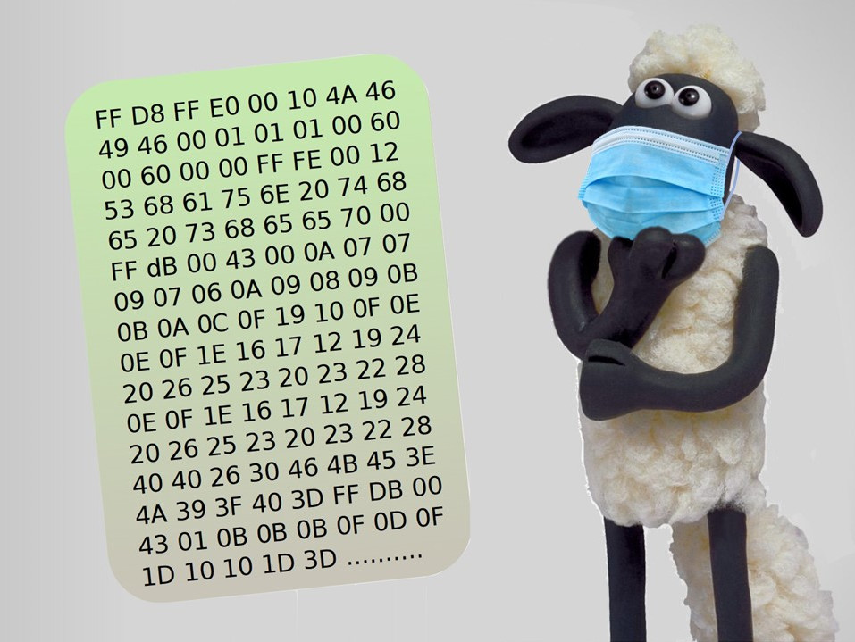
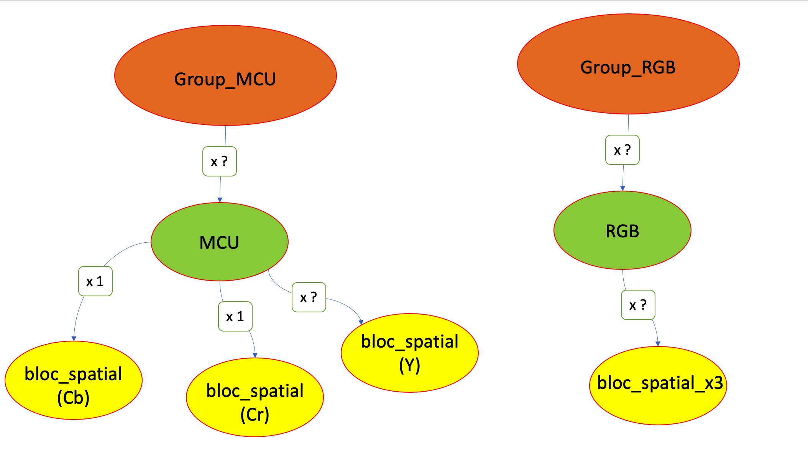
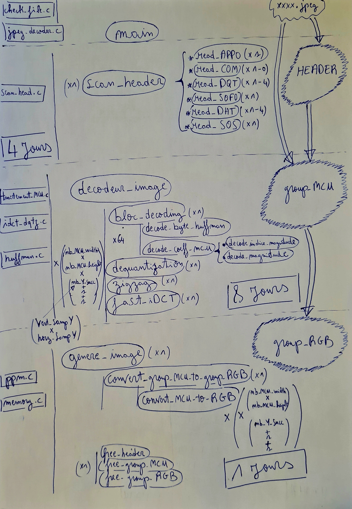

# Ensimag - Printemps 2024 - Projet Logiciel en C
### Sujet : Encodeur JPEG

### Auteurs : Des enseignants actuels et antérieurs du projet C

## 1. Introduction
Le format JPEG est l'un des formats les plus répandus en matière d'image numérique. Il est en particulier utilisé comme format de compression par la plupart des appareils photo numériques, étant donné que le coût de calcul et la qualité sont acceptables, pour une taille d'image résultante petite.

Le codec¹ JPEG est tout d'abord présenté en détail au chapitre 2 et illustré sur un exemple en annexe A. Le chapitre 3 présente le mode progressif, à attaquer une fois votre encodeur baseline sequential terminé. Le chapitre 4 présente les spécifications, les modules et outils fournis, et quelques conseils importants d'organisation pour ce projet. Finalement, le chapitre 5 formalise le travail à rendre et les détails de l'évaluation.

L'objectif de ce projet est de réaliser en langage C un encodeur qui convertit les images au format brut (PPM) en un format compressé (JPEG). Il est nécessaire d'avoir une bonne compréhension du codec, qui reprend notamment des notions vues dans les enseignements Théorie de l'information et Bases de la Programmation Impérative. Mais l'essentiel de votre travail sera bien évidemment de concevoir et d'implémenter votre encodeur en langage C.

Bon courage à tou(te)s, et bienvenue dans le monde merveilleux du JPEG ! Enjoy !

## 2. Le JPEG pour les petits : mode séquentiel
Le JPEG (Joint Photographic Experts Group) est un comité de standardisation pour la compression d'image dont le nom a été détourné pour désigner une norme en particulier, la norme JPEG, que l'on devrait en fait appeler ISO/IEC IS 10918-1 | ITU-T Recommendation T.81.¹

Cette norme spécifie plusieurs alternatives pour la compression des images en imposant des contraintes uniquement sur les algorithmes et les formats du décodage. Notez que c'est très souvent le cas pour le codage source (ou compression en langage courant), car les choix pris lors de l'encodage garantissent la qualité de la compression. La norme laisse donc la réalisation de l'encodage libre d'évoluer. Pour une image, la qualité de compression est évaluée par la réduction obtenue sur la taille de l'image, mais également par son impact sur la perception qu'en a l'œil humain. Par exemple, l'œil est plus sensible aux changements de luminosité qu'aux changements de couleur. On préférera donc compresser les changements de couleur que les changements de luminosité, même si cette dernière pourrait permettre de gagner encore plus en taille. C'est l'une des propriétés exploitées par la norme JPEG.

Parmi les choix proposés par la norme, on trouve des algorithmes de compression avec ou sans perte (une compression avec pertes signifie que l'image décompressée n'est pas strictement identique à l'image d'origine) et différentes options d'affichage (séquentiel, l'image s'affiche en une passe pixel par pixel, ou progressif, l'image s'affiche en plusieurs passes en incrustant progressivement les détails, ce qui permet d'avoir rapidement un aperçu, quitte à attendre pour avoir l'image entière).

Dans son ensemble, il s'agit d'une norme plutôt complexe qui doit sa démocratisation à un format d'échange, le JFIF (JPEG File Interchange Format). En ne proposant au départ que le minimum essentiel pour le support de la norme, ce format s'est rapidement imposé, notamment sur Internet, amenant à la norme le succès qu'on lui connaît aujourd'hui. D'ailleurs, le format d'échange JFIF est également confondu avec la norme JPEG. Ainsi, un fichier possédant une extension .jpg ou .jpeg est en fait un fichier au format JFIF respectant la norme JPEG. Évidement, il existe d'autres formats d'échange supportant la norme JPEG comme les formats TIFF ou EXIF. La norme de compression JPEG peut aussi être utilisée pour encoder de la vidéo, dans un format appelé Motion-JPEG. Dans ce format, les images sont toutes enregistrées à la suite dans un flux. Cette stratégie permet d'éviter certains artefacts liés à la compression inter-images dans des formats types MPEG.

L'encodeur JPEG demandé dans ce projet doit supporter le mode dit "baseline sequential" (compression avec pertes, séquentiel, Huffman). Ce mode est utilisé dans le format JFIF, et il est décrit dans la suite de ce document.

### 2.1 Principe général du codec JPEG
Cette section détaille les étapes successives mises en œuvre lors de l'encodage, c'est-à-dire la conversion d'une image au format PPM vers une image au format JPEG.

Tout d'abord, l'image est partitionnée en macroblocs ou MCU pour Minimum Coded Unit. La plupart du temps, les MCUs sont de taille 8x8, 16x8, 8x16 ou 16x16 pixels selon le facteur d'échantillonnage (voir section sous-échantillonnage). Chaque MCU est ensuite réorganisée en un ou plusieurs blocs de taille 8x8 pixels.

La suite porte sur la compression d'un bloc 8x8. Chaque bloc est traduit dans le domaine fréquentiel par transformation en cosinus discrète (DCT). Le résultat de ce traitement, appelé bloc fréquentiel, est encore un bloc 8x8 mais dont les coordonnées ne sont plus des pixels, c'est-à-dire des positions du domaine spatial, mais des amplitudes à des fréquences données. On y distingue un coefficient continu DC aux coordonnées (0,0) et 63 coefficients fréquentiels AC.² Les plus hautes fréquences se situent autour de la case (7,7).

L'œil étant moins sensible aux hautes fréquences, il est plus facile de les filtrer avec cette représentation fréquentielle. Cette étape de filtrage, dite de quantification, détruit de l'information pour permettre d'améliorer la compression, au détriment de la qualité de l'image (d'où l'importance du choix du filtrage). Elle est réalisée bloc par bloc à l'aide d'un filtre de quantification, qui peut être générique ou spécifique à chaque image. Le bloc fréquentiel filtré est ensuite parcouru en zig-zag (ZZ) afin de transformer le bloc en un vecteur de 64x1 fréquences avec les hautes fréquences en fin. De la sorte, on obtient statistiquement plus de 0 en fin de vecteur.

Ce bloc vectorisé est alors compressé en utilisant successivement plusieurs codages sans perte : d'abord un codage RLE pour exploiter les répétitions de 0, un codage des différences plutôt que des valeurs, puis un codage entropique³ dit de Huffman qui utilise un dictionnaire spécifique à l'image en cours de traitement.

Les étapes ci-dessus sont appliquées à tous les blocs composant les MCUs de l'image. La concaténation de ces vecteurs compressés forme un flux de bits (bitstream) qui est stocké dans le fichier JPEG. Ces données brutes sont séparées par des marqueurs qui précisent la longueur et le contenu des données associées. D'autres informations générales (taille de l'image, etc.) sont aussi ajoutées dans l'en-tête du fichier. Le format et les marqueurs sont spécifiés dans l'annexe B.

Les opérations de codage/décodage sont résumées sur la figure ci-dessous, puis détaillées dans les sections suivantes (dans le sens du décodage). L'annexe A fournit un exemple numérique du codage d'une MCU.

## 2.2 Représentation des données

Il existe plusieurs manières de représenter une image. Une image numérique est en fait un tableau de pixels, chaque pixel ayant une couleur distincte. Dans le domaine spatial, le codec utilise deux types de représentation de l'image.

Le format RGB, le plus courant, est le format utilisé en entrée. Il représente chaque couleur de pixel en donnant la proportion de trois couleurs primitives: le rouge (R), le vert (G), et le bleu (B). Une information de transparence alpha (A) peut également être fournie (on parle alors de ARGB), mais elle ne sera pas utilisée dans ce projet. Le format RGB est le format utilisé en amont et en aval de l'encodeur.

Un deuxième format, appelé YCbCr, utilise une autre stratégie de représentation, en trois composantes: une luminance dite Y, une différence de chrominance bleue dite Cb, et une différence de chrominance rouge dite Cr. Le format YCbCr est le format utilisé en interne par la norme JPEG. Une confusion est souvent réalisée entre le format YCbCr et le format YUV.4

La stratégie de représentation YCbCr est plus efficace que le RGB (Red, Green, Blue) classique, car d'une part les différences sont codées sur moins de bits que les valeurs et d'autre part elle permet des approximations (ou de la perte) sur la chrominance à laquelle l'œil humain est moins sensible.

## 2.3 Découpage de l'image en MCUs

## 2.4 Conversion RGB vers YCbCr

## 2.5 Compression des MCUs
##   ----------------------
    **2.5.1 Sous-échantillonnage de l'image**
    **2.5.2 Ordre d'écriture des blocs**

## 2.6 Transformée en cosinus discrète (DCT)

## 2.7 Quantification et zig-zag
    **2.7.1 Zig-zag**
    **2.7.2 Quantification**
    **2.7.3 Ordre des opérations**

## 2.8 Compression d'un bloc fréquentiel
    **2.8.1 Le codage de Huffman**
    **2.8.2 Coefficient continu: DPCM, magnitude et arbre DC**
        **2.8.2.1 Représentation par magnitude**
        **2.8.2.2 Encodage dans le flux de bits: Huffman**
    **2.8.3 Arbres AC et codage RLE**
        **2.8.3.1 Codage des coefficients AC**
        **2.8.3.2 Encodage dans le flux**

## 2.9 Ecriture dans le flux JPEG
    **2.9.1 Structure d'un fichier JPEG**
    **2.9.2 Byte stuffing**

# struct HEADER

# struct group_MCU/group_RGB

# architecture

